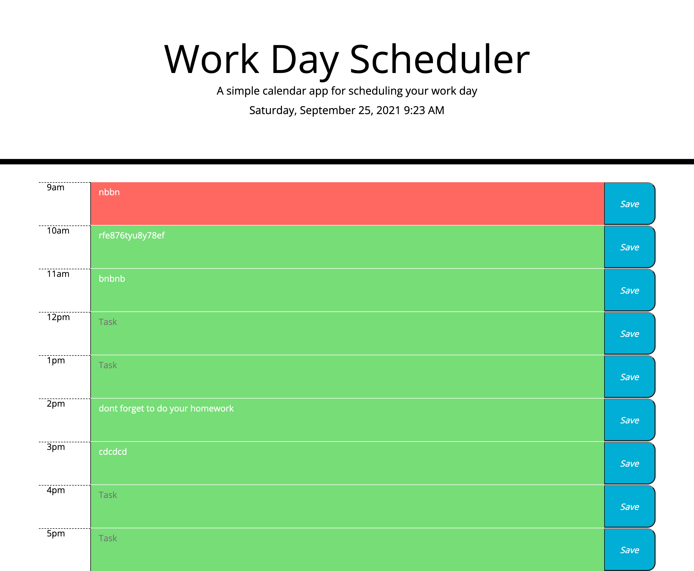

# Work Day Scheduler Website

- The Work Day Scheduler is an interactive website that allows a user to save tasks on an hourly basis for a typical work day. The scheduler also informs the user of upcoming and past tasks by changing the task columns to differnt colors. A gray column means its past, a red column is the current hour and a green column means the task is upcoming.

# Work Day Scheduler Starter Code

- In this project I was given starter code and asked to apply an HTML row/column section and apply JavaScript to make the webpage interactive according to the given mockup.

    1. I added the row/column section using bootstrap and gave the elements the corrosponding class from the provided CSS style sheet.

    2. Linked a Moment() library so the webpage had the current day at the top, in 12 hour format and each column had the time in 24 hour format.

    3. Created a for loop to iterate through each hour and then used set and get to save and retreive the task inputs from the user.

    4. DOM manipulation was used to add the past, present, and future classes so that the rows displayed the correct color code.

    5. created a repository on GitHub at URL https://github.com/mmelendez3/Work-Day-Scheduler

    6. This is the address fo the live URL https://mmelendez3.github.io/Work-Day-Scheduler/

    7. Here is a screenshot of the finished website.

        - 